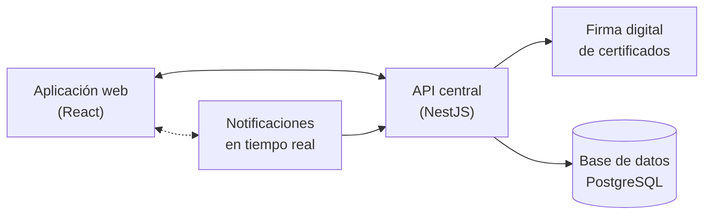

# Sistema Informático del Centro de Metrología del Ejército Ecuatoriano (CMEE)


Plataforma web para la **gestión administrativa, gestión de calidad y validación/firma digital de certificados** de los cinco laboratorios del Centro de Metrología del Ejército Ecuatoriano (CMEE). Desarrollada en el marco de las pasantías de la Universidad de las Fuerzas Armadas ESPE.

## Tabla de contenidos

- [Sobre el proyecto](#sobre-el-proyecto)
- [Características](#características)
- [Arquitectura](#arquitectura)
- [Stack tecnológico](#stack-tecnológico)
- [Seguridad y trazabilidad](#seguridad-y-trazabilidad)
- [Puesta en marcha](#puesta-en-marcha)
- [Licencia](#licencia)

## Sobre el proyecto

El CMEE gestiona la emisión, revisión, validación y firma de certificados técnicos de sus cinco laboratorios (masa, longitud, temperatura, presión y volumen), además de sus procesos administrativos y de gestión de calidad. Este sistema centraliza todo ese flujo en una única plataforma: control de personal y laboratorios, gestor documental con firma digital, recepción de equipos de clientes y un módulo de auditoría que deja trazabilidad completa de cada operación.

## Características

- **Gestión administrativa** de personas, puestos, departamentos y laboratorios.
- **Gestor documental** con carpetas, documentos y flujo de validación y firma digital de certificados.
- **Recepción de equipos** de clientes institucionales, con seguimiento por laboratorio.
- **Gestión de calidad** de los procesos de cada laboratorio.
- **Usuarios y permisos** por roles, con niveles de acceso configurables por grupo.
- **Auditoría integral**: cada acción queda registrada de forma automática, con trazabilidad de quién hizo qué y cuándo.
- **Notificaciones en tiempo real** entre usuarios conectados.
- **Reportes** administrativos y de gestión.

## Arquitectura

Vista general de los componentes del sistema y cómo se comunican entre sí:



La aplicación web consume una API central que concentra la lógica de negocio, el control de acceso y la persistencia en PostgreSQL. Los certificados se firman digitalmente antes de quedar disponibles, y los cambios relevantes se notifican en tiempo real a los usuarios conectados.

## Stack tecnológico

| Capa | Tecnologías |
|---|---|
| Frontend | React 18, Vite, TypeScript, Tailwind CSS, shadcn/ui |
| Backend | NestJS 10, Prisma ORM, PostgreSQL |
| Tiempo real | Socket.IO |
| Firma digital | Firma y verificación de certificados en formato PDF |

## Seguridad y trazabilidad

El sistema maneja documentación técnica y certificados de calidad emitidos para una institución militar, por lo que la seguridad no es un extra:

- **Autenticación** mediante JWT en cada sesión.
- **Control de acceso por roles (RBAC)**: cada usuario solo ve y opera lo que su rol y grupo le permiten, con distintos niveles de acceso por módulo.
- **Contraseñas cifradas**, nunca almacenadas en texto plano.
- **Auditoría automática** de toda acción de creación, edición o eliminación, e intentos de inicio de sesión.
- **Acceso restringido por origen** entre el frontend y la API.

## Puesta en marcha

El proyecto está dividido en dos partes independientes, `backend/` y `frontend/`, cada una con sus propias instrucciones de instalación en su carpeta correspondiente.

```bash
git clone <url-del-repositorio>
cd CMEE_SGD
```

- **Backend**: API REST en NestJS, ver [`backend/`](backend).
- **Frontend**: aplicación web en React, ver [`frontend/`](frontend).

Con el backend corriendo, la documentación interactiva de la API (Swagger) queda disponible en `/api/docs`.

## Licencia

Proyecto privado desarrollado para el Centro de Metrología del Ejército Ecuatoriano. Todos los derechos reservados.
