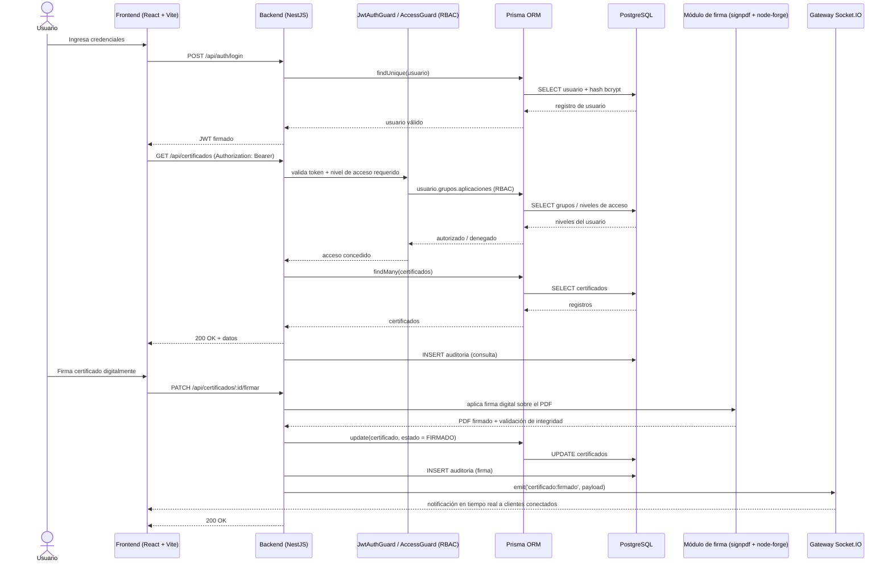

# Sistema Informático del Centro de Metrología del Ejército Ecuatoriano (CMEE)


Plataforma web para la **gestión administrativa, gestión de calidad y validación/firma digital de certificados** de los cinco laboratorios del Centro de Metrología del Ejército Ecuatoriano (CMEE). Desarrollada en el marco de las pasantías de la Universidad de las Fuerzas Armadas ESPE.

Monorepo con dos paquetes NPM independientes y sin orquestador de workspace: [`backend/`](backend) (API REST + WebSockets) y [`frontend/`](frontend) (SPA). Cada comando se ejecuta dentro de su respectiva carpeta.

## Tabla de contenidos

- [Características](#características)
- [Stack tecnológico](#stack-tecnológico)
- [Arquitectura y flujo de datos](#arquitectura-y-flujo-de-datos)
- [Estructura del repositorio](#estructura-del-repositorio)
- [Requisitos previos](#requisitos-previos)
- [Instalación](#instalación)
- [Datos iniciales (seeding)](#datos-iniciales-seeding)
- [Scripts disponibles](#scripts-disponibles)
- [Documentación de la API](#documentación-de-la-api)
- [Seguridad y auditoría](#seguridad-y-auditoría)
- [Despliegue en producción](#despliegue-en-producción)
- [Estándares de contribución](#estándares-de-contribución)
- [Licencia](#licencia)

## Características

- **Gestión administrativa**: personas, puestos, departamentos, laboratorios y grupos.
- **Gestor documental**: carpetas, documentos y certificados con flujo de validación y firma digital.
- **Recepción de equipos**: registro de equipos y circuitos asociados a los laboratorios.
- **Clientes institucionales** y catálogo de servicios ofrecidos por el Centro.
- **Gestión de calidad**: módulo dedicado a los procesos de calidad de los laboratorios.
- **Usuarios y permisos**: control de acceso basado en roles (RBAC) mediante grupos y aplicaciones con niveles de acceso.
- **Auditoría**: registro automático de operaciones de escritura (crear/actualizar/eliminar), consultas filtradas e intentos de inicio de sesión.
- **Notificaciones en tiempo real** vía WebSockets (Socket.IO).
- **Reportes** y configuración general del sistema.

## Stack tecnológico

| Capa | Tecnologías |
|---|---|
| Backend | NestJS 10, Prisma ORM 5, PostgreSQL, Passport + JWT, Socket.IO, class-validator/class-transformer, Swagger, bcrypt |
| Frontend | React 18, Vite 5, TypeScript, Tailwind CSS v4, shadcn/ui (Radix), TanStack React Query v5, React Hook Form + Zod, Axios, Socket.IO Client |
| Firma digital | `@signpdf/signpdf`, `@signpdf/signer-p12`, `node-forge` (firma y verificación de certificados PDF) |

## Arquitectura y flujo de datos

Diagrama de secuencia del flujo típico: autenticación, consulta autorizada por RBAC, firma digital de un certificado y notificación en tiempo real al resto de clientes conectados.



## Estructura del repositorio

Monorepo simple, sin workspace ni `package.json` en la raíz: cada paquete es autónomo con su propio `package.json` y `package-lock.json`.

```
CMEE_SGD/
├── backend/
│   ├── prisma/
│   │   ├── schema.prisma          # esquema de datos (PostgreSQL, ~39 modelos)
│   │   └── migrations/            # historial de migraciones (gitignored en local)
│   ├── src/
│   │   ├── auth/
│   │   │   ├── guards/            # JwtAuthGuard, AccessGuard (RBAC)
│   │   │   ├── decorators/        # @RequireAccess('app', nivel)
│   │   │   └── jwt.strategy.ts
│   │   ├── prisma/                # PrismaService (cliente inyectable)
│   │   ├── usuarios/ roles/ grupos/ aplicaciones/
│   │   ├── personas/ puestos/ persona-puesto/ departamentos/
│   │   ├── laboratorios/ equipos/ recepcion-equipos/ circuitos/
│   │   ├── certificados/ documentos/ carpetas/           # gestor documental
│   │   ├── clientes-institucionales/ servicios/
│   │   ├── calidad/ reportes/ configuracion-general/
│   │   ├── auditoria/                                    # interceptor global de auditoría
│   │   ├── notificaciones/                                # gateway de Socket.IO
│   │   ├── common/                                        # utilidades compartidas (pipes, filtros)
│   │   └── main.ts                                        # bootstrap: prefijo /api, CORS, ValidationPipe, Swagger
│   │       # cada módulo sigue el layout estándar de Nest:
│   │       # *.module.ts · *.controller.ts · *.service.ts · dto/ · entities/
│   └── uploads/                    # archivos subidos (fotos de personas, PDFs del gestor documental)
│
└── frontend/
    └── src/
        ├── core/
        │   ├── router/              # rutas centralizadas (AppRouter.tsx)
        │   └── api/                 # instancia única de Axios: inyecta JWT, maneja 401/403
        ├── modules/                 # un módulo de negocio por dominio (vista + hooks + llamadas API propias)
        │   ├── auth/ usuarios/
        │   ├── administrativo/      # personas, puestos, departamentos
        │   ├── laboratorios/ verificacion/
        │   ├── gestor_documental/
        │   ├── calidad/ rrhh/
        │   ├── auditoria/
        │   └── inicio/
        └── shared/
            ├── components/          # diseño atómico: atoms/ molecules/ organisms/
            ├── hooks/                # hooks reutilizables (no hay Context API dedicado: la sesión
            │                         # vive en localStorage y se hidrata vía interceptor de Axios)
            ├── interfaces/ utils/ data/
            └── utils/firma-pdf/      # utilidades de firma/validación de PDF en cliente
```

## Requisitos previos

- [Node.js](https://nodejs.org/) 18 o superior
- [PostgreSQL](https://www.postgresql.org/) 14+ en ejecución (local o remoto)
- npm (gestor de paquetes usado en ambos proyectos; cada uno mantiene su propio `package-lock.json`)

## Instalación

Clona el repositorio:

```bash
git clone <url-del-repositorio>
cd CMEE_SGD
```

### Backend

```bash
cd backend
npm install
cp .env.example .env   # completa DATABASE_URL, JWT_SECRET, etc.
npx prisma migrate dev # crea/actualiza el esquema en tu base de datos
npx prisma generate    # regenera el cliente de Prisma
npm run start:dev      # http://localhost:3001
```

Variables de entorno (`backend/.env`):

| Variable | Descripción |
|---|---|
| `DATABASE_URL` | Cadena de conexión a PostgreSQL |
| `JWT_SECRET` | Secreto para firmar los tokens JWT |
| `JWT_EXPIRES_IN` | Tiempo de expiración del token (ej. `7d`) |
| `PORT` | Puerto del servidor (por defecto `3001`) |
| `NODE_ENV` | `development` \| `production` |

### Frontend

```bash
cd frontend
npm install
cp .env.example .env   # define VITE_API_URL
npm run dev            # http://localhost:5173
```

Variables de entorno (`frontend/.env`):

| Variable | Descripción |
|---|---|
| `VITE_API_URL` | URL base de la API backend (ej. `http://localhost:3001/api`) |

## Datos iniciales (seeding)

> ⚠️ **Estado actual**: el repositorio aún no incluye un script de seed versionado en `backend/prisma/`. La sección siguiente documenta el estándar recomendado para poblar los catálogos base (roles, aplicaciones del sistema y laboratorios) antes de dar de alta usuarios reales.

1. Crear `backend/prisma/seed.ts` con los datos base, por ejemplo:

   ```ts
   import { PrismaClient } from '@prisma/client';

   const prisma = new PrismaClient();

   async function main() {
     await prisma.aplicacion.createMany({
       data: [
         { nombre: 'usuarios' },
         { nombre: 'laboratorios' },
         { nombre: 'gestor_documental' },
         { nombre: 'auditoria' },
       ],
       skipDuplicates: true,
     });

     await prisma.laboratorio.createMany({
       data: [
         { nombre: 'Laboratorio de Masa' },
         { nombre: 'Laboratorio de Longitud' },
         { nombre: 'Laboratorio de Temperatura' },
         { nombre: 'Laboratorio de Presión' },
         { nombre: 'Laboratorio de Volumen' },
       ],
       skipDuplicates: true,
     });

     await prisma.rol.createMany({
       data: [{ nombre: 'Administrador' }, { nombre: 'Analista de Calidad' }],
       skipDuplicates: true,
     });
   }

   main()
     .catch((e) => {
       console.error(e);
       process.exit(1);
     })
     .finally(() => prisma.$disconnect());
   ```

2. Registrar el comando en `backend/package.json`:

   ```json
   "prisma": {
     "seed": "ts-node --transpile-only prisma/seed.ts"
   }
   ```

3. Ejecutar:

   ```bash
   cd backend
   npx prisma db seed
   ```

## Scripts disponibles

### Backend (`cd backend`)

| Script | Descripción |
|---|---|
| `npm run build` | Compila con `nest build` → `dist/` |
| `npm run start:dev` | Levanta el servidor en modo watch |
| `npm run start:prod` | Ejecuta la build de producción (`dist/main`) |
| `npm run test` | Pruebas unitarias con Jest |
| `npm run test:cov` | Pruebas unitarias con reporte de cobertura |
| `npm run test:e2e` | Pruebas end-to-end |
| `npm run lint` | ESLint con `--fix` |
| `npm run format` | Formatea `src/` y `test/` con Prettier |
| `npm run docs:backend` | Genera documentación con Compodoc en `docs/backend/` |

### Frontend (`cd frontend`)

| Script | Descripción |
|---|---|
| `npm run dev` | Servidor de desarrollo de Vite |
| `npm run build` | Typecheck (`tsc -b`) + build de producción |
| `npm run lint` | ESLint (flat config) |
| `npm run preview` | Sirve la build de producción localmente |

> El frontend aún no cuenta con un framework de pruebas configurado.

## Documentación de la API

Con el backend corriendo, la documentación interactiva (Swagger) está disponible en:

```
http://localhost:3001/api/docs
```

## Seguridad y auditoría

El sistema maneja documentación técnica y certificados de calidad emitidos para una institución militar, por lo que la trazabilidad y el control de acceso son requisitos de diseño, no opcionales:

- **Autenticación**: JWT (`Authorization: Bearer <token>`) mediante Passport, validado en cada request por `JwtAuthGuard`.
- **Autorización (RBAC)**: cada usuario pertenece a uno o más *grupos*, y cada grupo tiene niveles de acceso (1–5) sobre *aplicaciones* del sistema. Los endpoints protegidos declaran el permiso mínimo requerido con el decorador `@RequireAccess('nombreAplicacion', nivel)`, evaluado por `AccessGuard` en `backend/src/auth/guards/access.guard.ts`.
- **Hashing de contraseñas**: las credenciales se almacenan con `bcrypt` (nunca en texto plano).
- **Validación y sanitización de entradas**: `ValidationPipe` global con `whitelist` + `forbidNonWhitelisted` + `transform` — cualquier campo no declarado explícitamente en el DTO es rechazado antes de llegar al controlador.
- **CORS restringido**: habilitado únicamente para el origen configurado en `FRONTEND_URL`, con credenciales.
- **Auditoría de trazabilidad**: un `AuditoriaInterceptor` global registra automáticamente toda operación de escritura (POST/PATCH/DELETE), consultas filtradas relevantes e intentos de inicio de sesión en la tabla `auditoria`, sin necesidad de instrumentar cada endpoint manualmente.
- **Firma digital de certificados**: validación e integridad de documentos mediante `@signpdf/signpdf`, `@signpdf/signer-p12` y `node-forge`.

## Despliegue en producción

> Guía de referencia recomendada; estos archivos de infraestructura aún no están versionados en el repositorio y deben adaptarse al servidor destino antes de usarse.

### Opción A — Docker Compose

```yaml
# docker-compose.yml (referencia)
services:
  db:
    image: postgres:16
    restart: unless-stopped
    environment:
      POSTGRES_DB: cmee
      POSTGRES_USER: cmee
      POSTGRES_PASSWORD: ${DB_PASSWORD}
    volumes:
      - db_data:/var/lib/postgresql/data

  backend:
    build: ./backend
    restart: unless-stopped
    env_file: ./backend/.env
    ports:
      - "3001:3001"
    depends_on:
      - db

  frontend:
    build: ./frontend
    restart: unless-stopped
    ports:
      - "5173:80"   # servido como build estático (Nginx dentro de la imagen)
    depends_on:
      - backend

volumes:
  db_data:
```

### Opción B — PM2 + Nginx como reverse proxy

Sin contenedores, usando un gestor de procesos para el backend (build de Node) y sirviendo el frontend como estático detrás de Nginx:

```bash
# Backend
cd backend
npm run build
pm2 start dist/main.js --name cmee-api --env production

# Frontend
cd frontend
npm run build   # genera dist/ estático
```

```nginx
# /etc/nginx/sites-available/cmee (referencia)
server {
    listen 80;
    server_name cmee.example.mil.ec;

    # SPA (build estático de Vite)
    root /var/www/cmee/frontend/dist;
    location / {
        try_files $uri $uri/ /index.html;
    }

    # API NestJS como reverse proxy
    location /api/ {
        proxy_pass http://127.0.0.1:3001/api/;
        proxy_http_version 1.1;
        proxy_set_header Upgrade $http_upgrade;   # necesario para Socket.IO
        proxy_set_header Connection "upgrade";
        proxy_set_header Host $host;
        proxy_set_header X-Real-IP $remote_addr;
    }
}
```

Recomendaciones adicionales: servir siempre detrás de HTTPS (Let's Encrypt / certificado institucional), restringir `FRONTEND_URL`/CORS al dominio real de producción, y ejecutar `npx prisma migrate deploy` (no `migrate dev`) en el despliegue.

## Estándares de contribución

### Commits

Se sigue el estándar [Conventional Commits](https://www.conventionalcommits.org/), en español, consistente con el historial actual del repositorio:

```
<tipo>: <descripción breve en imperativo>
```

| Tipo | Uso |
|---|---|
| `feat` | Nueva funcionalidad |
| `fix` | Corrección de errores |
| `refactor` | Cambio de estructura interna sin alterar comportamiento |
| `docs` | Cambios de documentación (README, comentarios, etc.) |
| `chore` | Tareas de mantenimiento (dependencias, config) |
| `test` | Agregar o corregir pruebas |
| `style` | Formato, sin cambios de lógica |

Ejemplo real del historial: `feat: integrar módulo de notificaciones y vinculación de departamentos en laboratorios y recepción de equipos`.

### Flujo de trabajo (Git)

- `main` — rama estable/desplegable.
- `feat/<área>`, `fix/<área>` — ramas de trabajo por funcionalidad o corrección (ej. `feat/backend`, `feat/frontend`).
- Antes de integrar a `main`: correr `npm run lint` y `npm run test` en `backend/`, y `npm run build` (typecheck) en `frontend/`.
- No hay CI/CD configurado todavía — estas verificaciones se ejecutan manualmente antes de cada merge.

## Licencia

Proyecto privado desarrollado para el Centro de Metrología del Ejército Ecuatoriano. Todos los derechos reservados.
